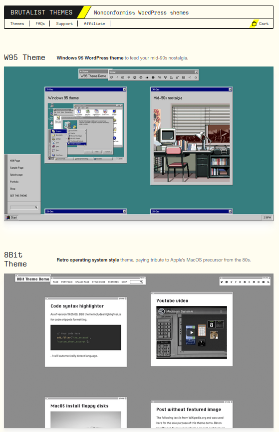
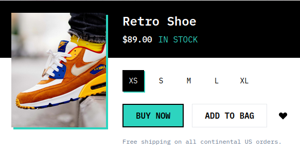

# Portfolio Site

This README is a background behind how / why I designed this site. If you are interested in the site itself, check it
out at [wkaisertexas.github.io](https://wkaisertexas.github.io/)

## Purpose

This is my personal portfolio site. I am a student who is looking to study Computer Science and is interested in Machine
Learning, Web Development, and more.

## Brutalist Design

Brutalism completely rejects that human-centric aspects of architecture. In many ways, it is architecture to make you
feel small. Though there are **countless** examples of bad brutalism (IE: just ugly buildings), when done well,
Brutalism is a style that I quite enjoy.

This Brutalist movement has transitioned into the field of webpage. The major inspiration for this project
was [brutalistthemes.com](https://brutalistthemes.com) and their homepage's color scheme.

> If actually interested in Brutalism, the [Wikipedia page](https://en.wikipedia.org/wiki/Brutalist_architecture) does a better job than I at explaining it.

The **spark** to use Brutalism was TailwindCSS's default brutalism template. With its harsh boarders and mid-90's low
CSS aesthetic, what is not to like?

## Layout

This site has a main page containing:

- Info about me
- Resume
- Projects
- Articles I have written
- A [Google Data Studio report](https://datastudio.google.com/reporting/e1bb6678-b8fa-4918-ab84-ddc35097590e)
  summarizing my projects

## FAQs

- ***Why the Bread?***
  I make a ton of bread. Recently, I gave into bread being a central tenet to my personality. So now bread has become my
  personal brand and will stay that way for the foreseeable future.
- ***Why not a framework?***
  When starting this project, I thought that I could be sneaky and avoid using a framework. I just ran into spaghetti code, though. Pain.
- ***I see Three.js stuff in the code, are you adding this?***
  Yes, I will be adding Three.js, I just wanted to render the breadiverse (tm) in the background because I thought it coud be fun.
- ***Data Science Projects?***
  Where are they? Not here yet, I am still trying to wrangle the styles to make them look good.
> ### Contact
> Hey, if you have any questions about the site, feel free to email me @ [wkaisertexas@gmail.com](mailto:wkaisertexas@gmail.com).