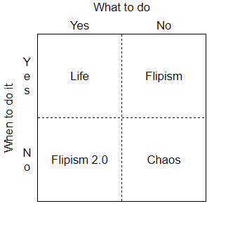

Chaos Engineering — if nothing else, it is a good name. Best utilized by Netflix to ensure reliability, Chaos Monkey randomly deletes parts of Netflix’s network, introducing artificial chaos. If the network can withstand artificial chaos, it is more likely to withstand real-world chaos. Chaos describes actions so unpredictable that for all intents and purposes they are random.

This to me disproved what I thought for a long time: chaos is inextricably linked to decay. Most people, including myself, take the point of view of an insurance adjuster when it comes to randomness — hoping the small chance of something bad happening (hurricane, earthquake, etc.) does not. The awful sound of TV static does not help either.

Illogical, because humans are the products of randomness. Natural selection requires random variation to function, but the result, evolution, is non-random growth.

This realization inspired me to use chaos as an agent of personal change.

## Personality Change Post COVID

For some context, I am a senior in high school who had my sophomore and junior years interrupted by COVID (senior year was mostly back to normal). In the before times, I considered myself somewhat extroverted, but isolation led to dramatic behavioral changes.

Logically, distance from social interaction made the value of social interaction higher for me. The problem with this was caring too much to the point where I was not willing to take risks socially. Ironically, this made me more isolated, creating a negative feedback loop. It was paralyzing.

The ways in which humans react to randomness are hardly rational. According to [Warren et al.](https://www.ncbi.nlm.nih.gov/pmc/articles/PMC5933241/), the risk of random events happening is directly linked to the ability of the subject to visualize the outcome. So, if you can visualize a dramatic event, you think it has a greater chance of happening, leading to a large number of irrational fears.

Following through with social interaction was not difficult for me, but I needed a consistent form of “activation energy” to start.

## Using Flipism V2 as a Solution

Initially, I looked to Flipism — a decision-making framework that uses a flip of a coin to resolve disputes. Comically described in Donald Duck’s “Flip Decision” as having “an incredible ability to predict the future, some of the time,” Flipism works when the quality of decision making is inconsequential compared to the costs of inaction.

Flipism for me was a failure. I wanted to have control over my decisions. When the coin flip was not to my liking, inaction was always easier.

## Decision-Making Framework Comparison

Normally, we control what to do as well as when to do it. Flipism gives you control of when to do something since you decide when to flip the coin, but not what to do as one of the two outcomes could occur. Flipism 2.0 provides a more psychologically acceptable alternative: give up on _when_.

I found my answer in the Shortcuts app, a block-based programming language for creating automation on IOS. Critically, it allows text messages to be sent automatically.

Instead of using randomness to determine _what_ I would do, I would use randomness to determine _when_ I would do something. Messages were created with a random chance of being sent every day. With any non-zero probability, eventually, a message will be sent (barring physical limitations).

Implementation of Flipsim 2.0 consisted of two shortcuts: _Random_ and _Create Message_. _Create Message_ prompts the user for the message, the recipient of the message, and the odds of this message being sent every day. Then, _Random_ gets run at a specified time (5 pm for me). _Random_ goes through all of the messages and generates random numbers to see what messages get sent.

Summer of 2021 was a personal psychological experiment to change my personality, and my “first texts” to friends this summer were all automated.

What was the content? In all honesty, most messages were dumb: stupid jokes, memes, etc. Other messages organized social events. For example, I hosted a game night with random attendees. Finally, some messages initiated _necessary_ discussions.

The automation’s sound was initially terrifying. What got sent? The classical fight-or-flight response was triggered as both distance and time needed to be put between my phone before checking what was sent.

## Did it work?

The initial hypothesis was that fear of uncontrollable, random events would drive actions (ie. you create a message, but end up sending it manually).

Fear-driven action did happen, as predicted by the initial hypothesis, but it was far less significant than the automation simply stopping me from forgetting. If I got an idea for a message at a culturally inappropriate time (really late or early), I could simply create a message, and I needed to do nothing in the future.

Though objectively, I spent more time with friends this summer than ever, most of the growth was subjective. Demonstrating growth is difficult. In conversations, though, there exist moments where you could either back off or double down. A discernible trend has taken place toward the latter. After this experiment, I find myself committing to more jokes, and just all around being more assertive.

## Applications

Though this was a great catalyst for personal growth, I did not continue it during the school year. Having no idea what you are going to do is stressful, and I did not want to compound this with the routine stress of school.

Despite this, what this program represents could be significant.

It is often said that three things define someone’s success: talent, hard work, and risk-taking, respectively. Talent is immutable, people try to teach hard work through schooling, yet risk-taking is not promoted. Positive risk-taking more specifically, or risk-taking with a net positive benefit.

Committing to things at some random time in the future is so much easier psychologically. With that friction removed, I was able to put myself out there more. Therefore, positive risk-taking was promoted through this strategy.

The application of this rather _unique_ strategy is dubious, but there exist two main benefits of this strategy: promotion of risk-taking and perhaps just as significant providing a method of communication with your prior self. Better interpersonal communication is the same reason why journaling works. Just like journals, the messages you write are a reflection of your state at the time; therefore, why they get sent, you get a glimpse of the thinking of your past self.
