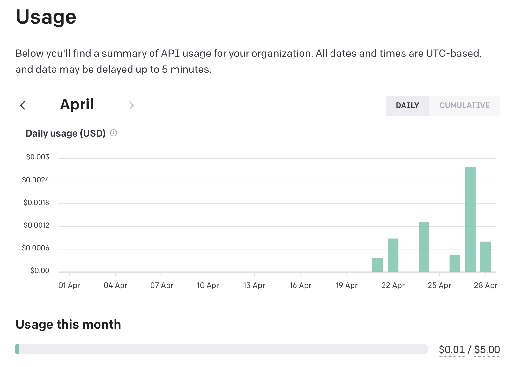
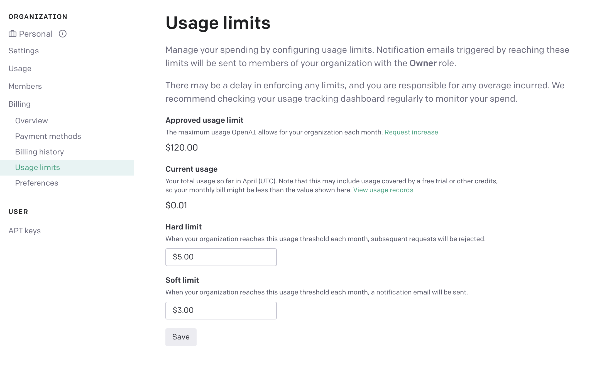
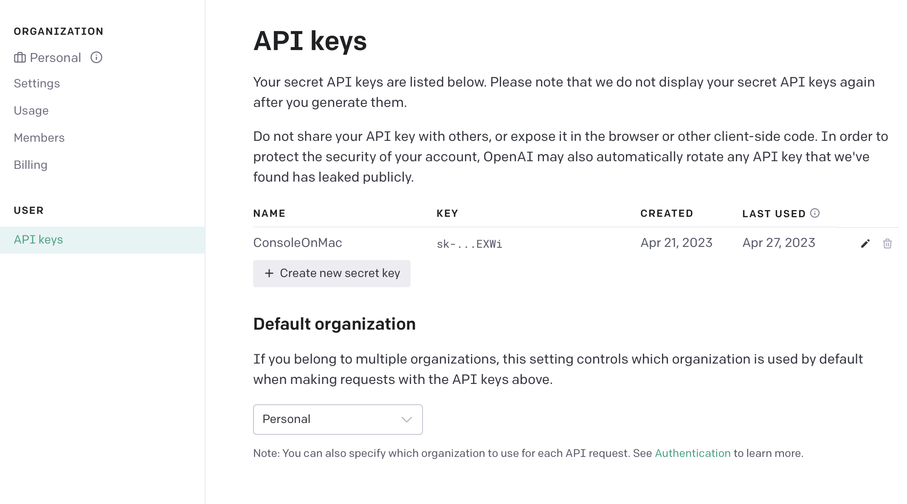

**ChatGPT** is great and provides a quick way to gain a little bit of knowledge about practically anything. However, if you are like me, you spend a lot of time in your terminal; not having to alt-tab to a browser would be a huge timesaver.[^3]

In this tutorial, we are going to make a command line application which clones **OpenAI's ChatGPT** using the official API to give the same chat functionality in your terminal.

This take-home lab is designed to give you a bit of experience with:
- Creating command line applications
- Creating a `npm` packages and `node` projects
- Creating accounts with software vendors
- Using Application Programming Interfaces (APIs)
- Dealing with API keys

## Steps 

### Install Node

Make sure you have node package manager `npm` and `node` installed on your system. If you do not have it installed, you can download it from the [official website](https://nodejs.org/en/).

<!-- [Inspiration](https://github.com/BuilderIO/ai-shell/blob/main/src/commands/chat.ts) -->

## Create a Node project

First, open up a terminal and create a new directory for your project. Then change into that directory. Next, create a new `npm` project which will create a special `package.json` file which stores dependencies and other information needed to run, build and publish your project.

```bash
mkdir chat-gpt-cli
cd chat-gpt-cli
npm init -y
code .
```

## Install the required dependencies

Writing your own code is hard. However, node has a huge ecosystem of packages which can make your life easier. In this case, we are going to use:

- **cleye:** a package which makes creating typed command line interfaces super simple
- **clack:** a **Text UI library (TUI)** which allows for very nicely formatted command line output. Has prebuilt components for:
  - text blocks
  - input blocks
  - spinners
  - more
- **OpenAI:** OpenAI's JavaScript wrapper[^1]. 

```bash
npm install -D cleye @clack/prompts openai
```

## Create a file for your entrypoint

`index.js` is the entrypoint for your `node` program. However, `index.js` by default is not set up to parse command-line arguments. Handling these arguments requires `cleye`.[^2] 

```javascript
import { cli } from 'cleye';
import { outro, text, spinner } from '@clack/prompts';
import OpenAI from 'openai';

const argv = cli({
  name: 'index.js',
  parameters: [
    '[arguments...]', 
  ],
})

let initial_prompt = argv._.arguments.join(' ');
```

<details>
<summary>Arguments are an array of strings.</summary>
Because spaces define separate arguments, joining separate words together with a space is required to get back to string form.
</details>

## Editing your `package.json`

Node does not like to use `import` statements unless you tell it to. To do this, you need to add a `type` field to your `package.json` file.

```json
{
  "type": "module"
}
```

## Getting API keys

We are going to do this a little bit backwards and explain how to get API keys into your program securely. To do this, we need to leverage **environment variables**. While scary-sounding, your environment variables look something like this:

**Example Code:**
```bash
export USERNAME=johndoe
export GITHUBAPIKEY=n83ncxz9m39a012
```

> In my opinion, using upper case for environment variables is less readable when compared to `snake_case` or `camelCase`. Using all caps is merely **convention** through. 

These are effectively "common variables" which other programs can access. Reading an environment variable is easy and something which is accessible to **all programs**. 

```bash
echo $GITHUBAPIKEY
```

```javascript
const github_api_key = process.env.GITHUBAPIKEY;
```

### Why not just store it in your code?

Why not just put the key in your code? First, having keys in your code can made updating them kind of cumbersome (changing environment variables remotely can be really quick). Second, security. You could accidentally commit your code to a public repository. One of your team members could go rouge and post it online. You could accidentally use the production api key in testing and accidentally delete your user's data. 

> Committing your API key accidentally is such a large problem on sites like **GitHub** that automated companies will search your code for "high entropy strings" and automatically notify you if detected.

## Creating a OpenAI account

Setting up an account with a third-party service can be a bit tedious, but actually going through the motions. Got to [playground.openai.com](http://playground.openai.com) and setup an account if you have not made one already.

> This **technically** costs money, but this particular API is comically cheap. My cost to use `gpt-3.5-turbo` has been less than $0.01 for about 150 requests.



## Set a limit

**DO THIS**. No one talks about the accidentally leaving a web service running to poverty pipeline. I though that $5 was reasonably fo me and adjusting this is easy in the future. If immediately losing access is a problem, setting a **soft limit** will give you an email when you are about to reach it.



> I once left an **AWS Free Tier S3 Instance** on and it ended up costing my parents several hundred dollars as my parents got the email and did not know what to do with it.

## Create an API key

Generate an API key and make sure to save this in your project in a file named `.env`.

> **Fun Fact:** files or folders with a leading `.` are not shown the the user immediately on MacOS or Linux. This is why the folder `.git` stores all of the information about a repository and `.env` can store environment values. In addition, programs like **Visual Studio Code** and **NetBrains** will create configuration files for your project which are hidden.



```bash
export OPENAI_API_KEY=/* Your AI key */
```

# Using your API key

Set your API key to a local variable when the user runs your command

```javascript
const openai = new OpenAI({
  apiKey: process.env["OPENAI_API_KEY"]
});
```

One of ChatGPT's killer features is the ability to answer new questions with the context of older ones.  when we call the API, we not only provide a single question, but also a list of prior ones.

```javascript
const chatHistory = []; // when the conversation starts, no history is present
```

# Code architecture

ChatGPT is &mdash; essentially &mdash; a series of prompts and responses. Therefore, instead of having a large `for` loop which handles each prompt, we could alternatively make a `prompt` function which handles this behavior for us. 

The prompt should first ask the user for some text. This is where `clack` can make both our output and code look much nicer.

```javascript
async function prompt(){
  const userPromptText = await text({
    message: "What do you want to say?",
    placeholder: `send a message (type 'exit' to quit)`,
    validate: (value) => {
        if(!value) return "please enter a valid prompt"
      }
    });

  // more code to come
}
```

Now, we have the user's prompt. Before doing anything else, a quick check to make sure the prompt is not exit is needed before going on.

```javascript
  if(userPromptText === 'exit'){ // javascript is weird and users triple equals to check for equality. Note using this can lead to some weird bugs
    outro("By, thanks for chatting with us")
    process.exit(0); // 0 means the program did not crash
  })
```

Now we are ready to start making a request. Using a `spinner` before going any further provides a visual indication that the program is working. After this, we must add the `userPromptText` to the chat history. Then, we must make a call to OpenAI to get the response.

```javascript
// still in prompt

const waitSpinner = spinner();
waitSpinner.start("Thinking...");

chatHistory.push({
    role: 'user',
    content: userPromptText
  })

const generatedText = await getResponse({
    prompt: chatHistory, // the history is the prompt
    openAIKEY
  })
```

 Because ChatGPT takes a few seconds to generate a response, the API gives a stream of data which is shown to the user incrementally (think about how [ChatGPT](https://chat.openai.com) gives you a word-by-word response). However, dealing with streams in this context is more complicated than necessary, so you are encourage this pre-provided snippet of code.

```javascript
async function getResponse(chatHistory){
  const completion = await openai.chat.completions.create({
    model: 'gpt-3.5-turbo',
    messages: chatHistory
  })
  return res.data.choices[0].message.content
}
```

In your process code, you want to first stop your spinner with a message. Then write the text you received as a string to standard output. Then, use a recursive call &mdash; a function which calls itself &mdash; to continue the chat loop.

```javascript
waitSpinner.stop("text completed")

console.log(generatedText);

console.log('\n\n'); // adding a few new lines

prompt(); // recursive call

// end of prompt
```

## Putting it all together

In case I lost you there, here is the full code for `index.js`. Alternatively, you are able to see [the full project on Github](https://github.com/wkaisertexas/chatgpt).

```javascript
import { cli } from 'cleye';
import { outro, text, spinner } from '@clack/prompts';
import OpenAI from 'openai';

const openai = new OpenAI({
  apiKey: process.env["OPENAI_API_KEY"]
});

const argv = cli({
  name: 'index.js',
  parameters: [
    '[arguments...]',
  ],
})

const chatHistory = [];

let initialPrompt = argv._.arguments.join(' ');

// TODO: Maybe you could find something to do with the initial prompt

async function getResponse(chatHistory){
  const completion = await openai.chat.completions.create({
    model: 'gpt-3.5-turbo',
    messages: chatHistory,
  })

  return completion.choices[0].message.content
}

async function promise(){
  const userPromptText = await text({
    message: "What do you want to say?",
    placeholder: `send a message (type 'exit' to quit)`,
    validate: (value) => {
      if(!value) return "please enter a valid prompt"
    }
  })

  if(userPromptText === 'exit'){
    outro("By, thanks for chatting with us")
    process.exit(0)
  }
  const waitSpinner = spinner();
  waitSpinner.start("Thinking...");

  chatHistory.push({
    role: 'user',
    content: userPromptText
  })

  const generatedText = await getResponse(chatHistory)

  waitSpinner.stop("Generation finished")

  console.log(generatedText)
  console.log("\n\n")

  chatHistory.push({
    role: 'system',
    content: generatedText
  })

  promise();
}

promise();
```

# Summary

This was a very busy activity, but through this, you got initial exposure to many things. Namely:

- **Textual User Interface Libraries (TUIs)** by using `clack` to make the output of your program much nicer
- **Creating Command Line Interfaces (CLIs)** with `cleye` so this application can be run on `MacOS`, `Linux` and `Windows`
- **Using an API wrapper** with `openai`
- **Functional Programming** by using anonymous and asynchronous functions
- **Using `node.js`** to run this function

However, this is not a complete program as there are some **UI / UX** steps we can take to make the output more human readable. A couple of these problems represent good first step to improve your program.

1. Using `clack` to display the results of the model
2. Rendering code block which have `\`\`\` code \`\`\`` surrounding to be drawn separately. This behavior comes from the [Markdown Syntax Guide](https://www.markdownguide.org/basic-syntax/)
  - Implementing all of Markdown highlighting is feasible for this project, but code highlighting can be a good first step.
3. Saving `chatHistory` to a file using the `JSON` file format and adding the ability to save and load previous conversations.
  - `require('fs')` and then using `fs.writeFileSync(location, text)`
  - `fs.readDir(folder, (err, files) => {/* Process them */})` will give you a list of files in a directory as a list
  - `JSON.stringify(object)` will turn an `object` into a `string`
  - `JSON.loads(object)` will turn a `string` into an `object`
  - `clack` has a `multiselect` option which takes a list of objects with `labels` and `values` and allows you to accept an option from them. You could use multiselect to select an old conversation to load.
  - `console.clear()` will clear the console and can help clean things up after a conversation is loaded.

## References

1. This tutorial was made for my [Machine-Learning with TensorFlow JS course](https://wkaisertexas.github.io/ml-with-tfjs) originally. I'm republishing it here for greater accessibility. 
2. The inspiration for this tutorial came from [BuilderIO's AI Shell](https://github.com/BuilderIO/ai-shell) which is a great project and open-source alternative to [GitHub Copilot X](https://github.com/features/copilot/).
3. If you want to see a completed version of this project, check out the [GitHub Repo](https://github.com/wkaisertexas/chatgpt).

---
[^1]: **OpenAI** has a **REST API** which is a series of endpoints for starting chats, creating accounts and more. However, **OpenAI** also has a `node` module which wraps the API into a nice set of functions for you and automatically handles the minor processing which you would have to otherwise implement. It is quite common for popular APIs to have wrappers in sometimes multiple languages (`python`, `javascript`, `java` are common). Reusing their pre-built wrapper code can be a great way to save time.
[^2]: **Cleye** is a pun as is phonetically similar to the acronym for command line interface, *CLI*.
[^3]: The hero image image presented is from [Google's Gemini (formerly Bard)](https://gemini.google.com/)