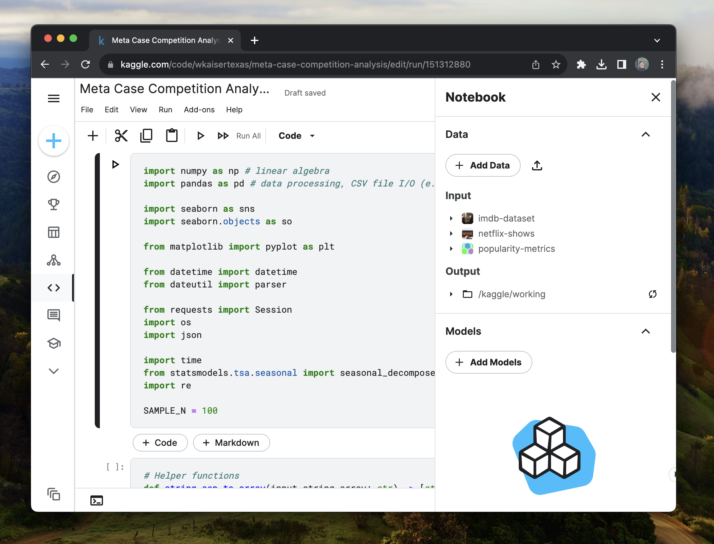

Jupyter Notebooks have become a cornerstone of data scientists and analysts with an environment that blends code execution, visualizations, and explanatory text. However, without proper structure, the flexibility that notebooks give can become a curse. In this guide, we'll explore key practices to enhance productivity and maintain code integrity within Jupyter Notebooks.

## What is a Jupyter Notebook?

JuPyter Notebooks are the most popular tool for data scientists and analysts to explore data. Notebooks are a web-based interactive environment which merges code, visualizations and markdown annotations into a single document. When compared to raw python scripts, Notebooks are more interactive and durable for creating exploratory code. Online platforms like [Kaggle](https://kaggle.com) and [Google Colab](https://colab.research.google.com) have made Notebooks easy to collaborate and share notebooks with others.



However, Jupyter Notebooks being unstructured and error tolerant can lead to some bad habits &mdash; when doing analysis. Over the years, I have built some long and complex notebooks &mdash; some over two thousand lines long. Along the way, I found some tips and tricks to keep me sane and productive with fast, organized notebooks.

## 1. Use Markdown

Markdown is a simple language for text formatting. If you would like a formal guide on using markdown, check out [Take 15 minutes to become a Markdown great](../great-markdown). Adding context, references, and explanations to your code is a great way to share your work with others and your future self.

<!--I should add an image which shows a markdown cell-->

<details>
  <summary>You will be amazed what you can do with Markdown</summary>

### 1.1. Embed Images

Embedding images is a great way to add context to your analysis. Images can be embedded using the following syntax:

```markdown

```

### 1.2. Embed Videos

Videos can be embedded using the following syntax:

```markdown
[](path/to/video.mp4)
```

### 1.3. Embed Tables

Tables can be embedded using the following syntax:

```markdown
| Column 1 | Column 2 |
| -------- | -------- |
| Row 1    | Row 1    |
| Row 2    | Row 2    |
```

### 1.4 Reference Local Files

Markdown can also reference local files. So, for instance, you can hide a cell which makes a graph and reference the graph with a relative image tag.

```markdown

```

That is the beginning of what markdown can do. For more, check out [Take 15 minutes to become a Markdown great](../great-markdown). Though you may not need to be the best documentarian, adding context to your code is a great way to share your work with others and your future self.

</details>

## 2. Use Type Hints

Type hints are a general python tip but are especially useful in notebooks. Type hints are a way to keep your functions organized when writing your code. Though some may argue that type hints are ugly and unnecessary for data science project, using type hints is a habit which will pay dividends in the long run.

```python
def convert_string_to_date(string: str) -> pd.datetime:
    return pd.to_datetime(string) if str(string) else None
```

## 3. Sample Your Data

When working with large and medium-size datasets, sampling your data is a great way to keep your notebook responsive. When re-running projects multiple times, the difference between a 10 - 20 and a 1-2 second wait can differentiate between a productive session and a frustrating one.

```python
df = pd.read_csv('data.csv')

df = df.sample(frac=1_000) # sample 1,000 rows

# or

df = df.sample(frac=0.01) # sample 1% of the rows
```

## 4. Don't Do Shit Twice

Expensive operations such as data loading should only be run once. While you may _try_ to not re-run the expensive loading operations &mdash; you probably will. A several gigabyte comma separated values (CSV) file can take tens of seconds to minutes depending on the size.

```python
df = pd.read_csv("imdb_movie_reviews.csv")
```

Instead of blindly calling `pd.read_csv`, redundancy protection can be as simple as checking if the variable, `df` is in `locals()`, a dictionary of all local variables.

```python
if 'df' not in locals():
  df = pdf.read_csv("imdb_movie_reviews.csv")
```

> Try and use a more modern data format like [Parquet](https://parquet.apache.org/) if possible which can be [87% smaller and 34x faster](https://www.databricks.com/glossary/what-is-parquet) than CSVs.

## 5. Do not mess up your original dataset

When thinking about what a cell should do, follow the guiding principles that cells &mdash; without error &mdash; should be able to be executed multiple times. hat does this mean? Why is this a best practice? Simply put: you are going to have to run your code multiple times. Structuring code which is durable enough to handle notebook re-runs helps you avoid hard resets.

Suppose we are given a dataframe which has the years as strings for some reason, making sure the code does not depend on the data type that is going to be replaced is super important.

```python
df = pd.read_csv("imdb_movie_reviews.csv")

df['year'] = df['year'].apply(lambda x: convert_string_to_date(x))
```

If we were to run this cell twice, we would get an error because the `year` column is now a datetime object and the `convert_string_to_date` function expects a string.

```python
df = pd.read_csv("imdb_movie_reviews.csv")

df['year'] = df['year'].apply(lambda x: convert_string_to_date(str(x)))
```

This is a simple fix, but it is a good example of how to avoid errors when re-running cells.

> Note: I know there is a better way to convert columns to dates, but this is just an example.

## Conclusion

A Jupyter Notebook is a great tool, but it should be thought of as having two modes: interactive and compiled. When crafting your analysis interactively, speed is king. Learning simple tricks like sampling your data, not re-running code and using the right data types can make a huge difference in your productivity.

When performing analysis, you generally write code, run it, write code, run it. If you are not careful and your code has to re-run every time and is generally slow, you will be waiting a lot. In fact, a first-year computer science student may suggest that you are debugging in `O(n^2)` time. Try and avoid that. Simple tips, applied consistently, can make a huge difference in your productivity.

> You've got to go slow to go fast
