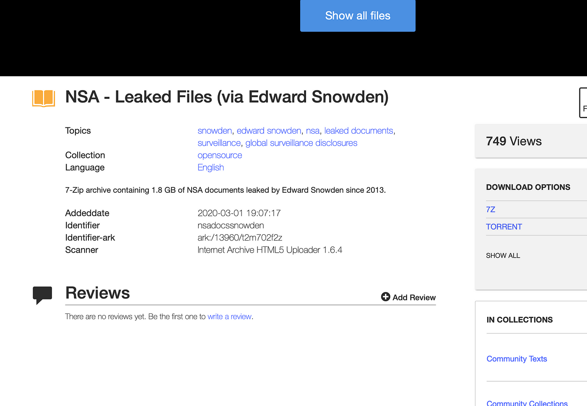

## Introduction

In 2013, Edward Snowden leaked classified documents about the National Security Agency’s surveillance activities. These documents contained sensitive information about the US government’s spying programs. However, access is not limited to journalists; you can download the files from [Archive.org](https://archive.org/details/nsadocssnowden). The leak is a folder of PDFs containing these documents. This blog post will discuss how I used a simple bash script with _ImageMagick_’s to convert the PDFs into images to create an awesome screensaver. 



## Converting PDFs into Images

Converting PDFs manually into images is a time-consuming process. However, it can be automated with a simple bash script. [_ImageMagick_](https://imagemagick.org/) is a free and open-source software suite that allows users to create, edit, and convert images. With _ImageMagick_, I was able to convert the Snowden leaks PDFs into images in just a few simple steps.

First, I downloaded and installed [_ImageMagick_](https://imagemagick.org/script/download.php) on my computer using [Homebrew](https://brew.sh/). Then, I created a new folder and placed all the PDFs in that folder. Next, I opened up the terminal and navigated to the directory where the PDFs were located. Finally, I created `convert.sh` with the following code:

```bash
for leak in leakes/*.pdf; do
	echo "Converting $leak"
	convert -density 70 *.pdf ${leak%.}%3d.png
done
```

For each PDF in the folder, this command tells _ImageMagick_ to convert it into a PNG. Using `${leak%.}%3d.png`, creates separate images for each page (`document001.png`, `document002.png`, etc.). The `-density 70` flag is used to set the resolution of the images.

## Screensaver

Once I had all the images, I created a new folder and placed all the PNG images in that folder. Then, I went to my computer’s settings and selected the folder containing the images as my screensaver source.

Now, whenever my computer is idle, it displays a slideshow of the Snowden leaks documents. Not only is it an interesting screensaver, but it also serves as a reminder of the importance of protecting our privacy and the need for transparency in government activities. I like to think of it as micro-dosing government secrets.

## Conclusion

Downloading the Snowden leaks was a fascinating experience, but the PDF format made it difficult to view the documents. Thanks to _ImageMagick_, I was able to easily convert the PDFs into images, which I then used as my screensaver. This post used a bash script with _ImageMagick_ to convert PDFs into images and how to set up those images as your screensaver.
