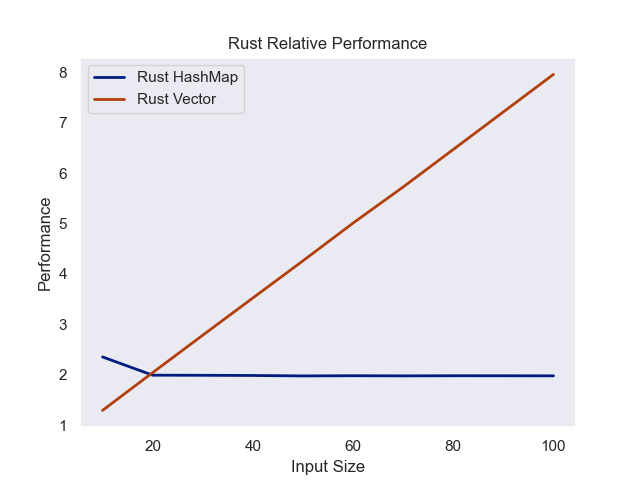
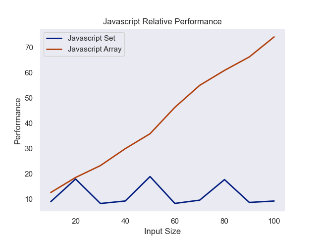
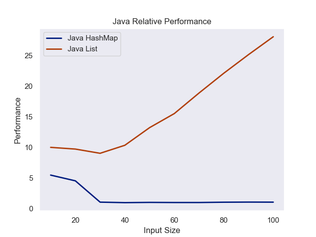

This piece was inspired by _ThePrimeagen_’s YouTube Video _This Algorithm is_ [_1,606,240% FASTER_](https://www.youtube.com/watch?v=U16RnpV48KQ)_._ Despite **both** the initial and final solution being linear in time-complexity (`O(n)`). One is over a million percent faster. This is a fascinating example of how performance is not necessarily equal to time-complexity &mdash; seemingly contradicting commonly taught knowledge about algorithms in computer science education.

## Problem

This video covers optimizing [2022 Advent of Code Day 6 Part 2](https://adventofcode.com/2022/day/6). Advent of Code Day 6 part 2 gives a simple problem: find 14 distinct (or non-repeating characters) characters in a row from an input string.

> Your device’s communication system is correctly detecting packets, but still isn’t working. It looks like it also needs to look for messages. A start-of-message marker is just like a start-of-packet marker, except it consists of 14 distinct characters rather than 4.

## Solution

The initial solution _ThePrimeagen_ presents uses a HashSet, a data structure which only holds unique values. The algorithm is simple: add 14 characters in a row and check the length of the set. If the set is smaller than 14, you must have added a duplicate.

```rust
fn simple(i: &[u8]) -> usize {
    return i.windows(14)
           .position(|w| {
            return w.iter().collect::<HashSet<_>>().len() == 14;
            })
           .map(|x| x + 14)
           .unwrap();
}
```

For those less familiar with Rust, this function uses windows to look the array in 14 character overlapping increments, creates a hash set for each position (group of 14 characters). Then, adds 14 to get the end instead of the beginning unique characters.

The first, most obvious optimization made was surprisingly: using a vector. This change was so significant that it lead to an **8.9x speedup**.

```rust
fn faster_vec(i: &[u8]) -> usize {
  return i.windows(14)
      .position(|w| {
        let mut vec = Vec::with_capacity(14);
        for x in w {
          if vec.contains(x){
            return false
          }
        vec.push(*x);
        }
        return true;
       })
      .map(|x| x + 14)
      .unwrap();
}
```

Despite alarm bells going off in my head from my first-year algorithms professor, a linear search here is still constant time because the size of the vector does not change with the increasing search size. Therefore, O(n) is really O(c) which gets approximated to O(1) for time-complexity estimation.

Vector’s advantages for small sized constant input lead me to wonder if I could create a heuristic for when HashSets are better than Vectors. Key takeaway: **tread lightly**.

---

## Methodology

_Rust_, _JavaScript_ and _Java_ were selected from the test. Vector (or vector equivalents like Array for _JavaScript_ and ArrayList for _Java_) and HashSet implementations were used for each language. Vectors and Sets of size 10 through 1,000 with intervals of 10 in between were tested. A million finds were timed for each trivial and the time was recorded in milliseconds to a CSV output.

## Problems

JavaScript’s Just In Time (JIT) compilation was finicky during testing. Initially, like _Rust_ and _Java_, the output of search was unsaved. This lead the compiler to feel fit to omit this section of code, resulting in zero lookup times. Preallocating an array with 1,000,000 elements was sufficient to trick the JIT to stop this behavior. Furthermore, JIT compilation only takes place after several runs. Practically speaking, JavaScript functions can experience a “cold start” of low performance before reaching a steady-state, optimized equilibrium.

## Code

The Code was initially written in Rust, then written in Java and JavaScript with minimal tweaks thanks to ChatGPT.

## Rust

```rust
use std::collections::HashSet;
use std::time::{Duration, Instant};

// Function to measure the time it takes to find an element in a HashSet
fn measure_hashset_time(n: usize) -> Duration {
    let hashset: HashSet<usize> = (0..n).collect();
    let start = Instant::now();
    for _ in 0..1_000_000{
        let _ = hashset.contains(&(n/2));
    }
    Instant::now() - start
}

// Function to measure the time it takes to find an element in a Vec
fn measure_vec_time(n: usize) -> Duration {
    let vec: Vec<usize> = (0..n).collect();
    let start = Instant::now();
    for _ in 0..1_000_000{
        let _ = vec.contains(&(n/2));
    }
    Instant::now() - start
}

fn main() {
    println!("Input Size,HashSet Time (ms),Vec Time (ms)");
    for x in 1..100 {
        let n: usize = x * 10;
        let hashset_time = measure_hashset_time(n).as_micros() as f64 / 1000.0;
        let vec_time = measure_vec_time(n).as_micros() as f64 / 1000.0;
        println!("{},{},{}", n, hashset_time, vec_time);
    }
}
```

> Only searching for the median, rather than a random element is entirely a function of not wanting to create a project to install rand.

## JavaScript

```javascript
// Function to measure the time it takes to find an element in an array
function measureArrayTime(n) {
  const array = Array.from({ length: n }, (_, i) => i);

  const res = Array.from({ length: 100_000 }, (_, i) => false);
  const start = performance.now();
  for (let i = 0; i < 1_000_000; i++) {
    res[i] = array.includes(n);
  }
  return performance.now() - start;
}

// Function to measure the time it takes to find an element in a map
function measureMapTime(n) {
  const map = new Set();
  for (let i = 0; i < n; i++) {
    map.add(i);
  }
  const res = Array.from({ length: 100_000 }, (_, i) => false);
  const start = performance.now();
  for (let i = 0; i < 1_000_000; i++) {
    res[i] = map.has(Math.floor(n / 2));
  }
  return performance.now() - start;
}

for (let i = 90; i < 100; i++) {
  // Cold Start Prevention
  measureArrayTime(i * 10);
  measureMapTime(i * 10);
}

console.log("Input Size,Array Time (ms),Map Time (ms)");
for (let x = 1; x < 100; x++) {
  const n = x * 10;
  const arrayTime = measureArrayTime(n);
  const mapTime = measureMapTime(n);
  console.log(`${n},${arrayTime.toFixed(2)},${mapTime.toFixed(2)}`);
}
```

## Java

```java
import java.util.ArrayList;
import java.util.HashSet;
import java.util.List;

public class Main {
    // Function to measure the time it takes to find an element in a HashSet
    public static long measureHashSetTime(int n) {
        HashSet<Integer> hashSet = new HashSet<>();
        for (int i = 0; i < n; i++) {
            hashSet.add(i);
        }
        long start = System.nanoTime();
        for (int i = 0; i < 1_000_000; i++) {
            hashSet.contains(n / 2);
        }
        return System.nanoTime() - start;
    }

    // Function to measure the time it takes to find an element in an ArrayList
    public static long measureArrayListTime(int n) {
        List<Integer> arrayList = new ArrayList<>();
        for (int i = 0; i < n; i++) {
            arrayList.add(i);
        }
        long start = System.nanoTime();
        for (int i = 0; i < 1_000_000; i++) {
            arrayList.contains(n / 2);
        }
        return System.nanoTime() - start;
    }

    public static void main(String[] args) {
        System.out.println("Input Size,HashSet Time (ms),ArrayList Time (ms)");
        for (int x = 1; x < 100; x++) {
            int n = x * 10;
            double hashSetTime = measureHashSetTime(n) / 1_000_000.0;
            double arrayListTime = measureArrayListTime(n) / 1_000_000.0;
            System.out.printf("%d,%.2f,%.2f%n", n, hashSetTime, arrayListTime);
        }
    }
}
```

## Results

This experiment was far less clear-cut as I would have hoped. Upon plotting, identifying definite where vectors do better is difficult. The **only** clear trend is that _Rust_’s performance is consistently better than _Java_ and _JavaScript_.

_Rust_ was not only the fastest, but the most regular of the tested languages. This looks like the classic O(1) versus O(n) charts taught.



Input size versus performance (measured in milliseconds per 1M searches)

_JavaScript_ was significantly more varied in it’s performance. Furthermore, arrays never technically performed better than sets, despite coming close. Furthermore, likely due to the non-random nature of each search, the Set performance was variable likely due to the indexing required.



Input size versus performance (measured in milliseconds per 1M searches)

Finally, _Java_’s performance clearly showed that Lists were never more performant than HashSets. Perhaps even stranger, HashSets got more performant after initially struggling. Java does have it’s own JIT compiler to translate Java bytecode to JVM instructions (Java is weird). However, I had not expected Java to have such a significant cold start when compared with Javascript.



Input size versus performance (measured in milliseconds per 1M searches)

## Conclusion

These tests are not perfect: far from it. However, these tests do disprove the hope that I had after watching _thePrimeagen_\’s video: leaving with a set of language-specific heuristics for when different data structures’ performance flip-flops.

Though, through considerable oversimplification, you could come up with a number of roughly 20 for _Rust_ and _Javascript_, assuming this is a dangerous in the context of a high-stakes interview question. Put simply, stick to HashSets and HashMaps being magical O(1) data structures — it is harder to mess up this way.

If this kind of optimization is fascinating to you, I recommend checking out Stand Up Math’s video on how [_Someone Improved my Code by 40,832,277,770%_](https://www.youtube.com/watch?v=c33AZBnRHks) that is conceptually similar.
