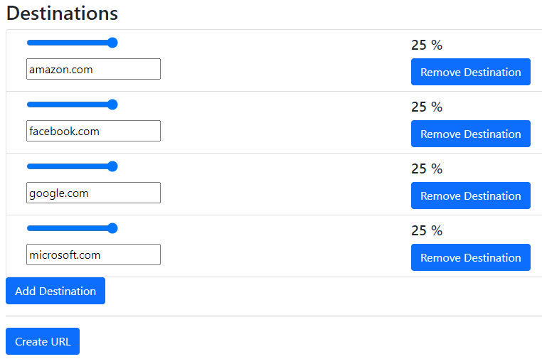

URL shorteners are the obvious plumbing on the internet. These are mostly necessary to make QR codes look nice, but the idea of creating a redirect can be incredibly powerful.

There already exist some open-source options, the most popular of which is [Polr](https://polrproject.org/), which has the main limitation of requiring self-hosting. Furthermore, useful features such as tracking link counts are not enabled. There does exist a good API for creating new links.

Random URL is a publicly hosted to make their own shortened URLs. Shortened links can have multiple destinations. Users have a random change of being sent to each site.

This is best explained in the context of an example: a high school club. If you are in a high school club, you probably have a couple of things: a remind, a website, and maybe a canvas page. To drum up interest in a club, putting up posters is one of the best ways. Having multiple QR codes on a page can just look ugly, so instead, create one QR code with a chance of sending you to each.

The schema for the link could be:

-   50 % — Remind join code
-   50 % — Club website

Creating a URL that takes the user to one of four tech websites.

One QR code can now replace many. Additionally, people getting different links tend to talk about it.

And, to address the elephant in the room, yes, you can create links that have a random chance of sending your friends to **funny** sites (pornography mostly).

Finally, the destinations of these shortened links are mutable. Posters can be put up, and then the links can simply be changed, rather than the poster. Therefore, if a club runs weekly events, the link can be changed per event.

More finally, you could theoretically print out business cards with a QR code, give a bunch of them out any time you want to announce them.

An **_accurate_** depiction of someone else receiving this card (Sigma male defeated).

I know this is a niche, impractical software. But, if any or all of this sounds interesting, check out [Random URL Shortener](https://random-url-generator.herokuapp.com/).