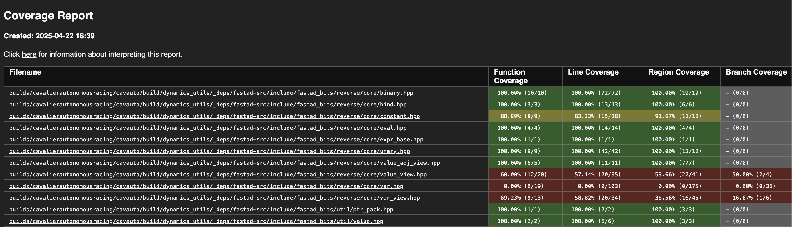

I recent set up test coverage reports for [Cavalier Autonomous Racing](https://autonomousracing.dev). Despite me thinking it was simple, it ended up taking me several hours. Read this post to avoid my pain.

I am assuming the stack uses:

- a ROS 2 Monorepo (we have 30+ nodes in our stack)
- clang(++) for C++ Code (**note** not standard to use this toolchain)
- CMakeLists
- colcon

## Tools Used

- [llvm-cov](https://llvm.org/docs/CommandGuide/llvm-cov.html)

## Setup

First, ensure the following are installed:

```sh
sudo apt update && sudo apt install -y \
  clang \
  llvm \
  lld \
  llvm-cov \
  file
```

```sh
#!/bin/bash
# =========
# Builds and outputs a coverage report using `llvm-cov` to `public` directory and then shows a summary of the coverage report

source /opt/ros/$ROS_DISTRO/setup.sh

PACKAGES_UP_TO="iac_launch"

colcon build \
  --merge-install \
  --packages-up-to $PACKAGES_UP_TO \
  --cmake-force-configure \
  --cmake-args \
  -DCMAKE_CXX_FLAGS="-g -Og -fprofile-instr-generate -fcoverage-mapping" \
  -DCMAKE_C_FLAGS="-g -Og -fprofile-instr-generate -fcoverage-mapping" \
  -DCMAKE_CXX_COMPILER="clang++" \
  -DCMAKE_C_COMPILER="clang"

# tells LLVM to output the profiles with the process name (`%p`) and the binary id (`%b`),
# used to avoid conflicts between profile names
LLVM_PROFILE_FILE="$PWD/%p.%b.profraw"

colcon test \
  --merge-install \
  --packages-up-to $PACKAGES_UP_TO \
  --event-handlers console_direct-

llvm-profdata merge -sparse *.profraw -o coverage.profdata

FILES=$(find install build -type f \( -executable -o -name '*.so' \) ! -path '*_msgs*' ! -name '*.py' ! -name '*.bin' -exec sh -c 'for f; do case "$(file --brief --mime-type "$f")" in application/x-executable|application/x-sharedlib) printf -- "--object=%s " "$f";; esac; done' _ {} +)

llvm-cov show \ 
  --format=html \
  --output-dir=public \
  --instr-profile=coverage.profdata \
  $FILES
```

After the report is generated, a summary is printed in the command line. Viewing the HTML report in a browser is as simple as running this locally.

```bash
python3 -m http.server -d . 8080
```

This produces a standard coverage report which everyone is used to seeing



## Why is this required?

If you examine the `llvm-cov` report it mentions that multiple files can be passed. However, the `--object=` is needed for each. Without this, only code coverage for the first passed library or executable and it will not tell you why.

```console
$ llvm-cov report --help
OVERVIEW: LLVM code coverage tool

USAGE: llvm-cov report [options] Covered executable or object file. --sources <Source files>

OPTIONS:

Color Options:

  --color                                                    - Use colors in output (default=autodetect)
```

This one issue took me **several** hours to debug, plus getting the binary filtering criteria strict enough to not cause the script to fail.

I hope this post helped you avoid some frustration.