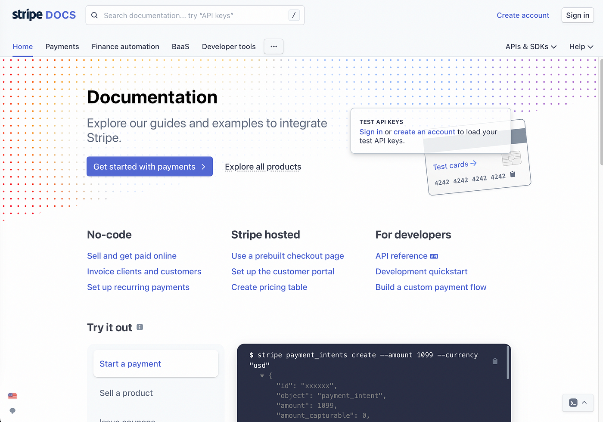
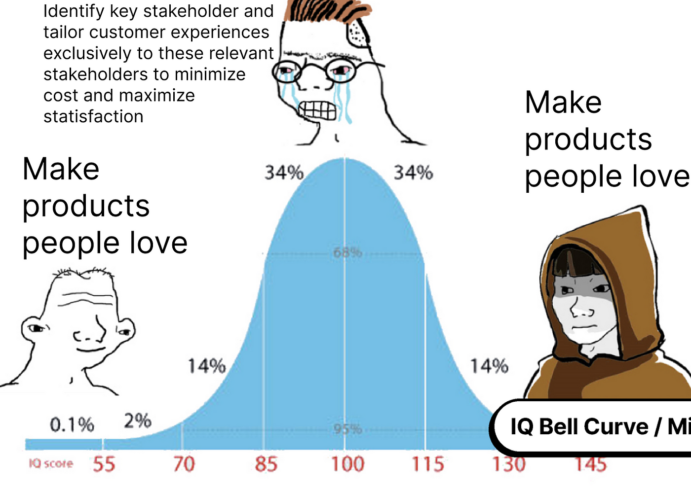

Stripe is unworthy of its design. However, Stripe’s excellence reveals a lesson about the keys to power in software sales.

Stripe has been the darling of Silicon Valley for quite some time (aside from a minor hiccup recently). Payments processing is the core business of Stripe. To oversimplify, an Stripe is a box which give your customer’s credit card information and it deposits money in your bank account.

Because of Stripe’s simplicity, Y-Combinator has made it the poster-child of doing things that do not scale. The likes of Dalton Caldwell and Michael Seibel will consistently tell stories about customer obsession over this seemingly simple product. In fact, Stripe being more expensive than competitors was a talking point from the founders when pitching. The ability to not be competing on price and still be used is clear evidence of product-market fit.

Stripe is without a doubt beautiful. Aside from art purists would would seek to disqualify Stripe on the groups that it is a corporate art style. From undescribably perfect gradients to main page micro-interactions. API documentation which forms the gold standard for the industry — something to which other companies aspire. From my personal opinion, Stripe ranks higher than YouTube, Google, Instagram and most every other major website when it comes to visual appeal.

Stripe’s design excellence is strange because: it is a payments processor, an API. Stripe working well is set it and forget it functionality. Compare this to YouTube which sees a billion hours of video content a day (the full working lives of 12.5 K people). On the logical access of design quality versus total time used, Stripe is a massive outlier.

Stripe’s decision to achieve excellence in design is a result of other companies oversight in decision making: overlooking software engineers. Software engineer’s quality of life was significant enough to make even legacy businesses change.

A common error when people become confused by product’s poor quality is a fundamental misunderstanding of the real buyer. School lunches are the perfect example. They suck and have sucked for quite a while. This is largely due to student’s considerations being secondary to that of administrators.

> A lot of **Meta** criticism also stems from lack of understanding the advertiser is the true customer.

While design is only a part of Stripe’s success and other, larger sites are often far more optimized than their design would initial suggest, Stripe does make a midwit out of all of us, showing the value of the naive design path. 

Stripe makes us the midwit — Making good products is most often the best path to success. Just build.

---

update: Feb 2024 - Stripe's founder Patrick Collison spoke about Stripe's commitment to the design and beauty of it's projects on the [Dwarkesh Podcast.](https://www.youtube.com/watch?v=WU-lBOAS1VQ&t=1493s). 

Also, the point was raised that people want to work at companies that make beautiful products. In this way, Stripe's design is also a recruiting and culture-building tool. A great insight.